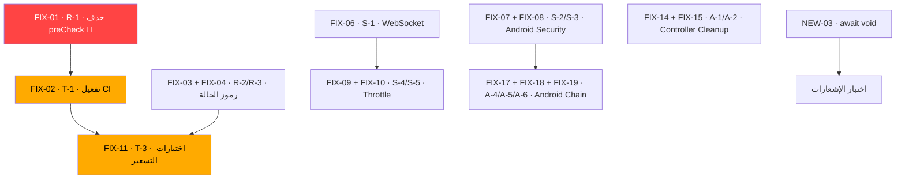

# خطة الإصلاح المفصّلة — FORERUN

| | |
|---|---|
| **المصدر** | [SECURITY-AND-CODE-REVIEW.md](file:///d:/FAWRUNF/FAWRUN/docs/SECURITY-AND-CODE-REVIEW.md) |
| **قاعدة التحقق** | `744bf23` |
| **تاريخ كتابة الخطة** | 2026-10-04 |
| **الحالة** | جاهزة للتنفيذ — **لا تعديل واحد تم بعد** |

> [!IMPORTANT]
> هذه الخطة مبنية على البنود المفتوحة في التقرير الأمني + أخطاء جديدة اكتُشفت أثناء المراجعة المعمّقة (القسم 6). كل بند يحمل رقم سطر دقيق ومُتحقَّق منه على الكود الحالي.

---

## جدول المحتويات

1. [المسار الأول — حرج 🔴 (ساعة واحدة)](#المسار-الأول--حرج--ساعة-واحدة)
2. [المسار الثاني — أخطاء برمجية ومالية 🟡](#المسار-الثاني--أخطاء-برمجية-ومالية-)
3. [المسار الثالث — الأمان 🟡](#المسار-الثالث--الأمان-)
4. [المسار الرابع — بنية الاختبارات 🟡](#المسار-الرابع--بنية-الاختبارات-)
5. [المسار الخامس — معماري وجودة 🟡](#المسار-الخامس--معماري-وجودة-)
6. [أخطاء جديدة مُكتشفة (غير موجودة في التقرير الأصلي)](#أخطاء-جديدة-مُكتشفة)
7. [المسار السادس — بنية تحتية وبيانات 🟡/🟢](#المسار-السادس--بنية-تحتية-وبيانات-)
8. [خارج نطاق الوكيل — قرارات بشرية](#خارج-نطاق-الوكيل--قرارات-بشرية)
9. [ترتيب التنفيذ والتبعيات](#ترتيب-التنفيذ-والتبعيات)

---

## المسار الأول — حرج 🔴 (ساعة واحدة)

### FIX-01 · R-1 · حذف حاجز preCheck في deliverOrder

> [!CAUTION]
> هذا البند الحرج الوحيد. حذف 7 أسطر يفتح مسار الـ Idempotency المغلق حالياً.

| البند | التفاصيل |
|---|---|
| **الملف** | [`runner-orders.service.ts`](file:///d:/FAWRUNF/FAWRUN/apps/api/src/modules/orders/services/runner-orders.service.ts#L1096-L1102) |
| **الأسطر** | `1096–1102` |
| **المشكلة** | `preCheckOrder` يُجري فحصاً خارج `$transaction` — إذا كان الطلب `DELIVERED` يرمي `ConflictException('ORDER_ALREADY_DELIVERED')` **قبل** الدخول للمعاملة. النتيجة: `processIdempotentDelivery` (`:810–826`) لا يُصل إليه أبداً عند إعادة المحاولة، والاسترجاع الآمن (`:1162–1170`) **معطّل فعلياً**. هذا يُبطل عقد الـ Idempotency الذي يحمي من تكرار قيد الـ Ledger. |
| **الخطورة** | 🔴 حرج — مالي |
| **الإجراء** | حذف الأسطر `1096–1102` كاملاً (الـ `findFirst` + شرط `if` + `throw`). الحماية كافية داخل المعاملة عبر `updateMany` الذري في `:832–839`. |

**الكود المطلوب حذفه:**
```diff
  ): Promise<...> {
-    // Pre-transaction 409 check: if already DELIVERED, return immediately without any action
-    const preCheckOrder = await this.prisma.order.findFirst({
-      where: { id: orderId },
-    });
-    if (preCheckOrder?.status === 'DELIVERED') {
-      throw new ConflictException('ORDER_ALREADY_DELIVERED');
-    }
-
     const result = await this.prisma.$transaction(
```

**التحقق بعد التنفيذ:**
```bash
# يجب ألا يظهر أي مطابقة
grep -n "preCheckOrder" apps/api/src/modules/orders/services/runner-orders.service.ts
```

---

### FIX-02 · T-1 · تفعيل اختبارات التكامل في CI

| البند | التفاصيل |
|---|---|
| **الملف** | [`.github/workflows/integration-tests.yml`](file:///d:/FAWRUNF/FAWRUN/.github/workflows/integration-tests.yml#L9) |
| **السطر** | `9` |
| **المشكلة** | `if: false` يُعطّل الـ job كلياً. الاختبارات موجودة وتعمل محلياً، لكن مسار التسليم المالي بلا بوابة تراجع آلية في CI. |
| **الخطورة** | 🟡 (عُدِّلت من 🔴 بقرار) — عيب عملية لا سلوك |
| **الإجراء** | حذف السطر `9` (`if: false`). |

```diff
  jobs:
    integration-tests:
-    if: false
      runs-on: ubuntu-latest
```

**التحقق:** بعد الحذف، إنشاء PR إلى `master` يجب أن يُشغِّل الـ job.

---

## المسار الثاني — أخطاء برمجية ومالية 🟡

### FIX-03 · R-2 · تصحيح رمز الحالة في calculateFee

| البند | التفاصيل |
|---|---|
| **الملف** | [`pricing.service.ts`](file:///d:/FAWRUNF/FAWRUN/apps/api/src/modules/pricing/pricing.service.ts#L53-L59) |
| **الأسطر** | `1` (import) + `53–59` |
| **المشكلة** | `ForbiddenException` (403) على خطأ مُدخَل (عدد متاجر غير صحيح) — خطأ دلالي. |
| **الإجراء** | |

**الخطوات:**
1. في السطر `1`، أضف `BadRequestException` للاستيرادات:
```diff
-import { Injectable, ForbiddenException, NotFoundException } from '@nestjs/common';
+import { Injectable, ForbiddenException, BadRequestException, NotFoundException } from '@nestjs/common';
```
2. في الأسطر `57–59`، استبدل:
```diff
-      throw new ForbiddenException(
+      throw new BadRequestException(
         'purchasedStoreCount must be a non-negative integer',
       );
```

---

### FIX-04 · R-3 · تصحيح رمز الحالة في recalculateFee

| البند | التفاصيل |
|---|---|
| **الملف** | [`pricing.service.ts`](file:///d:/FAWRUNF/FAWRUN/apps/api/src/modules/pricing/pricing.service.ts#L99-L103) |
| **الأسطر** | `1` (import) + `99–103` |
| **المشكلة** | تعارض حالة (طلب مسلَّم) يُرفع كـ `ForbiddenException` (403) بدل `ConflictException` (409). |
| **الإجراء** | |

**الخطوات:**
1. أضف `ConflictException` للاستيرادات في السطر `1`:
```diff
-import { Injectable, ForbiddenException, BadRequestException, NotFoundException } from '@nestjs/common';
+import { Injectable, ForbiddenException, BadRequestException, ConflictException, NotFoundException } from '@nestjs/common';
```
2. استبدل في `:100`:
```diff
-      throw new ForbiddenException(
+      throw new ConflictException(
         'Cannot recalculate fee for a delivered order',
       );
```

> [!NOTE]
> FIX-03 و FIX-04 يُنفذان معاً في نفس الملف. تأكد من عدم إزالة `ForbiddenException` من الاستيراد لأنها لا تزال مستخدمة.

**ملف واحد، تعديل مُنسّق — الاستيراد النهائي:**
```typescript
import { Injectable, ForbiddenException, BadRequestException, ConflictException, NotFoundException } from '@nestjs/common';
```
**ثم تحقق:** `ForbiddenException` لم تعد مستخدمة فعلياً في `pricing.service.ts` بعد FIX-03 + FIX-04 — **أزلها من الاستيراد** إن لم يبقَ لها استخدام آخر.

---

### FIX-05 · R-4 · تصحيح رمز الحالة عند فشل إفراج المندوب

| البند | التفاصيل |
|---|---|
| **الملف** | [`customer-orders.service.ts`](file:///d:/FAWRUNF/FAWRUN/apps/api/src/modules/orders/services/customer-orders.service.ts#L626-L632) |
| **الأسطر** | `630–631` |
| **المشكلة** | فشل إفراج المندوب بسبب تغيّر متزامن (`updateMany.count === 0`) يُرفع كـ `422 RUNNER_NOT_AVAILABLE` — مربك تشخيصياً، السبب الحقيقي هو تسابق لا عدم توفر. |
| **الخطورة** | 🟢 |
| **الإجراء** | |

```diff
           if (runnerUpdated.count === 0) {
-            throw new UnprocessableEntityException('RUNNER_NOT_AVAILABLE');
+            throw new ConflictException('CONCURRENT_RUNNER_STATE_CHANGE');
           }
```

> [!NOTE]
> نفس المشكلة موجودة في [`admin-order-command.service.ts:1012-1013`](file:///d:/FAWRUNF/FAWRUN/apps/api/src/modules/orders/services/admin-order-command.service.ts#L1012-L1013) (cancelOrderAdmin) و [`runner-orders.service.ts:909-910`](file:///d:/FAWRUNF/FAWRUN/apps/api/src/modules/orders/services/runner-orders.service.ts#L909-L910) (updateOrderAndRunnerState). يجب تطبيق نفس التصحيح في المواضع الثلاثة لاتساق الكود.

---

## المسار الثالث — الأمان 🟡

### FIX-06 · S-1 · فصل الحساب الموقوف من WebSocket

| البند | التفاصيل |
|---|---|
| **الملف** | [`orders.gateway.ts`](file:///d:/FAWRUNF/FAWRUN/apps/api/src/websocket/gateways/orders.gateway.ts#L61-L69) |
| **الأسطر** | `66–69` |
| **المشكلة** | البوابة تقرأ `status` ولكن تفحص `isDeleted` فقط. حساب `SUSPENDED` يبقى متصلاً ويستقبل أحداث الطلبات. |
| **الإجراء** | |

```diff
       if (!user || user.isDeleted) {
         client.disconnect(true);
         return;
       }
+
+      if (user.status === 'SUSPENDED') {
+        client.disconnect(true);
+        return;
+      }
```

> [!TIP]
> الـ `AdminGateway` ([`admin.gateway.ts:79`](file:///d:/FAWRUNF/FAWRUN/apps/api/src/websocket/gateways/admin.gateway.ts#L79)) يتحقق بشكل صحيح (`user.status !== 'VERIFIED'`). هذا الإصلاح يوحّد السلوك.

---

### FIX-07 · S-2 · حماية طباعة FCM Token في Android

| البند | التفاصيل |
|---|---|
| **الملف** | [`ForerunFirebaseMessagingService.kt`](file:///d:/FAWRUNF/FAWRUN/apps/android/app/src/main/java/com/forerun/customer/core/notification/ForerunFirebaseMessagingService.kt#L28) |
| **السطر** | `28` |
| **المشكلة** | `Log.d(TAG, "Refreshed FCM token received: $token")` يطبع التوكن كاملاً بلا شرط `BuildConfig.DEBUG`. |
| **الإجراء** | |

```diff
-        Log.d(TAG, "Refreshed FCM token received: $token")
+        if (BuildConfig.DEBUG) {
+            Log.d(TAG, "Refreshed FCM token received: $token")
+        }
```

---

### FIX-08 · S-3 · قواعد ProGuard لإزالة Log وحماية التشفير

| البند | التفاصيل |
|---|---|
| **الملف** | [`proguard-rules.pro`](file:///d:/FAWRUNF/FAWRUN/apps/android/app/proguard-rules.pro) |
| **المشكلة** | لا قاعدة لإزالة `android.util.Log` في بناء الإصدار، ولا حماية لـ `EncryptedTokenStorage`/`MasterKey`. |
| **الإجراء** | إضافة في نهاية الملف: |

```proguard
# --- FORERUN Security Rules ---

# Strip all Log calls in release builds
-assumenosideeffects class android.util.Log {
    public static int v(...);
    public static int d(...);
    public static int i(...);
    public static int w(...);
    public static int e(...);
}

# Keep encrypted storage classes
-keep class com.forerun.customer.core.storage.** { *; }
-keep class androidx.security.crypto.** { *; }
```

---

### FIX-09 · S-4 · تحديد معدل refresh و logout

| البند | التفاصيل |
|---|---|
| **الملف** | [`auth.controller.ts`](file:///d:/FAWRUNF/FAWRUN/apps/api/src/modules/auth/auth.controller.ts#L33-L44) |
| **الأسطر** | `33` و `40` |
| **المشكلة** | `POST /auth/refresh` و `POST /auth/logout` بلا `@Throttle` خاص. السقف العام 300/دقيقة مرتفع جداً. |
| **الإجراء** | |

```diff
   @Post('refresh')
   @Public()
   @HttpCode(HttpStatus.OK)
+  @Throttle({ refresh: { limit: 30, ttl: 60000 } })
   refresh(@Body(new ZodValidationPipe(RefreshSchema)) dto: RefreshRequest) {
     return this.authService.refresh(dto);
   }

   @Post('logout')
   @Public()
+  @Throttle({ logout: { limit: 30, ttl: 60000 } })
   logout(@Body(new ZodValidationPipe(LogoutSchema)) dto: LogoutDto) {
     return this.authService.logout(dto);
   }
```

---

### FIX-10 · S-5 · تحديد معدل device-token والمسارات الإدارية بلا حدّ

| البند | التفاصيل |
|---|---|
| **الملفات** | [`customers.controller.ts:67-81`](file:///d:/FAWRUNF/FAWRUN/apps/api/src/modules/customers/customers.controller.ts#L67-L81) · [`settlements.controller.ts:100-131`](file:///d:/FAWRUNF/FAWRUN/apps/api/src/modules/settlements/settlements.controller.ts#L100-L131) |
| **المشكلة** | `device-token` (POST + DELETE) بلا حدّ. مسارات الإدارة (`markSettled` / `listAdmin` / `getPendingSettlements`) بلا `@Throttle`. |
| **الإجراء** | |

**في `customers.controller.ts`:**
```diff
   @Post('customer/me/device-token')
+  @Throttle({ default: { limit: 10, ttl: 60000 } })
   async registerDeviceToken(...)

   @Delete('customer/me/device-token')
+  @Throttle({ default: { limit: 10, ttl: 60000 } })
   async unregisterDeviceToken(...)
```

**في `settlements.controller.ts`:**
```diff
   @Put('admin/settlements/:id/mark-settled')
   @Roles('ADMIN')
+  @Throttle({ default: { limit: 10, ttl: 60000 } })
   async markSettled(...)

   @Get('admin/settlements')
   @Roles('ADMIN')
+  @Throttle({ default: { limit: 30, ttl: 60000 } })
   async listAdmin(...)

   @Get('admin/settlements/pending')
   @Roles('ADMIN')
+  @Throttle({ default: { limit: 30, ttl: 60000 } })
   async getPendingSettlements(...)
```

---

## المسار الرابع — بنية الاختبارات 🟡

### FIX-11 · T-3 · إنشاء اختبارات وحدة لـ PricingService

| البند | التفاصيل |
|---|---|
| **الملف المطلوب إنشاؤه** | `apps/api/test/pricing/pricing.service.spec.ts` |
| **المشكلة** | صفر اختبارات للمحرّك الحسابي. |
| **السيناريوهات المطلوبة** | |

```
✅ calculateFee — متجر واحد، غير طرفي → baseFee فقط
✅ calculateFee — متجر واحد، طرفي → baseFee + peripheralFee
✅ calculateFee — 3 متاجر → baseFee + extraStoresFee * 2
✅ calculateFee — 0 متاجر → baseFee فقط (extraStoresFee = 0)
✅ calculateFee — purchasedStoreCount سالب → BadRequestException (بعد FIX-03)
✅ calculateFee — purchasedStoreCount كسري → BadRequestException (بعد FIX-03)
✅ runnerShare = floor(totalFee * 0.75)
✅ platformShare = ceil(totalFee * 0.25)
✅ runnerShare + platformShare >= totalFee (لا خسارة بالتقريب)
✅ recalculateFee — طلب DELIVERED → ConflictException (بعد FIX-04)
✅ recalculateFee — طلب عادي → يُحدّث الرسوم في DB
```

---

### FIX-12 · T-4 · إنشاء اختبارات لـ closeDay وconfirmSettlement

| البند | التفاصيل |
|---|---|
| **الملف المطلوب إنشاؤه** | `apps/api/test/settlements/settlements.service.spec.ts` |
| **الملف المرجعي** | [`settlements.service.ts:246–303`](file:///d:/FAWRUNF/FAWRUN/apps/api/src/modules/settlements/settlements.service.ts#L246-L303) |
| **السيناريوهات** | |

```
✅ closeDay — يوم بلا طلبات → نتيجة فارغة
✅ closeDay — يوم مُغلق مسبقاً (idempotency) → يتجاوز المناديب الموجودين
✅ closeDay — 3 مناديب، 5 طلبات → 3 settlements مع المبالغ الصحيحة
✅ calculateSettlementAmounts — floor/ceil يتطابقان مع `:140–141`
✅ markSettled — تسوية غير موجودة → NotFoundException
✅ markSettled — تسوية مُسلّمة مسبقاً → ConflictException
```

---

### FIX-13 · T-5 · إنشاء اختبارات لـ AdminOrderCommandService

| البند | التفاصيل |
|---|---|
| **الملف المطلوب إنشاؤه** | `apps/api/test/orders/admin-order-command.service.spec.ts` |
| **الملف المرجعي** | [`admin-order-command.service.ts`](file:///d:/FAWRUNF/FAWRUN/apps/api/src/modules/orders/services/admin-order-command.service.ts) |
| **السيناريوهات** | |

```
✅ approveOrder — PENDING_REVIEW → AWAITING_RUNNER (بلا مندوب مفضّل)
✅ approveOrder — مع مندوب مفضّل متاح → AWAITING_RUNNER
✅ approveOrder — مع مندوب مفضّل مشغول + waitForPreferred → AWAITING_PREFERRED_RUNNER
✅ rejectOrder — PENDING_REVIEW → CANCELLED مع سبب
✅ rejectOrder — طلب غير موجود → NotFoundException
✅ assignRunner — مندوب متاح → ASSIGNED + runner ON_MISSION
✅ assignRunner — مندوب لديه طلب نشط → ConflictException (BUG-017)
✅ cancelOrderAdmin — مع مندوب → يُعيد المندوب لـ AVAILABLE
```

---

## المسار الخامس — معماري وجودة 🟡

### FIX-14 · A-1 · نقل resolveOrderStore إلى ReceiptsService

| البند | التفاصيل |
|---|---|
| **الملف** | [`receipts.controller.ts:37-65`](file:///d:/FAWRUNF/FAWRUN/apps/api/src/modules/receipts/receipts.controller.ts#L37-L65) |
| **المشكلة** | `PrismaService` محقون في المتحكم + 3 استعلامات متسلسلة. |
| **الإجراء** | |

1. نقل `resolveOrderStore` (`:42–65`) إلى `ReceiptsService`.
2. إزالة `PrismaService` من constructor المتحكم.
3. إزالة استيراد `PrismaService` من المتحكم.
4. استدعاء `this.receiptsService.resolveOrderStore(...)` بدلاً من `this.resolveOrderStore(...)`.

---

### FIX-15 · A-2 · نقل resolveRunner إلى SettlementsService

| البند | التفاصيل |
|---|---|
| **الملف** | [`settlements.controller.ts:37-57`](file:///d:/FAWRUNF/FAWRUN/apps/api/src/modules/settlements/settlements.controller.ts#L37-L57) |
| **المشكلة** | نفس النمط + قاعدة تجارية (`:52–53`: التحقق من VERIFIED). |
| **الإجراء** | |

1. نقل `resolveRunner` (`:42–57`) إلى `SettlementsService`.
2. إزالة `PrismaService` من constructor المتحكم.
3. إزالة استيراد `PrismaService` من المتحكم.
4. استدعاء `this.settlementsService.resolveRunner(...)`.

---

### FIX-16 · A-3 · حذف RolesGuard المكرّر

| البند | التفاصيل |
|---|---|
| **المواضع** | 8 ملفات |
| **المشكلة** | `RolesGuard` مسجَّل عالمياً في `app.module.ts:142–144`، والديكور `@UseGuards(VerifiedUserGuard, RolesGuard)` يكرّره. |
| **الخطورة** | 🟢 |
| **الإجراء** | استبدال في كل موضع: |

```diff
-@UseGuards(VerifiedUserGuard, RolesGuard)
+@UseGuards(VerifiedUserGuard)
```

**المواضع (مُتحقَّق منها):**
1. [`orders.controller.ts:69`](file:///d:/FAWRUNF/FAWRUN/apps/api/src/modules/orders/orders.controller.ts#L69)
2. [`receipts.controller.ts:35`](file:///d:/FAWRUNF/FAWRUN/apps/api/src/modules/receipts/receipts.controller.ts#L35)
3. [`settlements.controller.ts:35`](file:///d:/FAWRUNF/FAWRUN/apps/api/src/modules/settlements/settlements.controller.ts#L35)

> [!NOTE]
> تحقق من `users.controller.ts` · `ledger.controller.ts` · `ratings.controller.ts` · `runners.controller.ts` أيضاً للتأكد من اكتمال الحذف.

ثم إزالة استيراد `RolesGuard` من كل ملف لم يعد يستخدمه.

---

### FIX-17 · A-4 · try/finally في logout بـ Android

| البند | التفاصيل |
|---|---|
| **الملف** | `apps/android/.../ui/home/HomeViewModel.kt:111–116` |
| **المشكلة** | عند فشل `logoutUseCase()` لا يُطلق `_navigateToLogin.emit` — المستخدم يعلق. |
| **الإجراء** | |

```diff
  fun logout() {
      viewModelScope.launch {
-         logoutUseCase()
-         _navigateToLogin.emit(Unit)
+         try {
+             logoutUseCase()
+         } finally {
+             _navigateToLogin.emit(Unit)
+         }
      }
  }
```

---

### FIX-18 · A-5 · معالجة فشل KeyStore في EncryptedTokenStorage

| البند | التفاصيل |
|---|---|
| **الملف** | `apps/android/.../core/storage/EncryptedTokenStorage.kt:16–30` |
| **المشكلة** | `MasterKey` و `EncryptedSharedPreferences.create` داخل `by lazy` بلا معالجة خطأ. فشل KeyStore يُسقط كل العمليات. |
| **الإجراء** | |

```kotlin
private val masterKey: MasterKey by lazy {
    runCatching {
        MasterKey.Builder(context)
            .setKeyScheme(MasterKey.KeyScheme.AES256_GCM)
            .build()
    }.getOrElse { ex ->
        // مسح التخزين المشفر وإعادة البناء
        context.getSharedPreferences("encrypted_prefs", Context.MODE_PRIVATE)
            .edit().clear().apply()
        MasterKey.Builder(context)
            .setKeyScheme(MasterKey.KeyScheme.AES256_GCM)
            .build()
    }
}
```

---

### FIX-19 · A-6 · تغليف استدعاءات tokenStorage في AuthRepositoryImpl

| البند | التفاصيل |
|---|---|
| **الملف** | `apps/android/.../data/.../AuthRepositoryImpl.kt:133, :141` |
| **المشكلة** | `getRefreshToken()` و `clearAll()` خارج `try` — فشل KeyStore يُفعّل سلسلة: A-5 → A-6 → A-4. |
| **الإجراء** | |

```kotlin
// `:133`
val refreshToken = runCatching { tokenStorage.getRefreshToken() }.getOrNull()
    ?: return Result.failure(IllegalStateException("No refresh token"))

// `:141`
runCatching { tokenStorage.clearAll() }
```

---

### FIX-20 · A-8 · حذف ملف logout.dto.ts الوسيط

| البند | التفاصيل |
|---|---|
| **الملف** | [`auth/dto/logout.dto.ts`](file:///d:/FAWRUNF/FAWRUN/apps/api/src/modules/auth/dto/logout.dto.ts) |
| **المشكلة** | ملف re-export بلا أي منطق. المصدر الحقيقي `@forerun/shared-types`. |
| **الخطورة** | 🟢 |
| **الإجراء** | |

1. في [`auth.controller.ts:6–7`](file:///d:/FAWRUNF/FAWRUN/apps/api/src/modules/auth/auth.controller.ts#L6-L7):
```diff
-import { LogoutSchema } from './dto/logout.dto.js';
-import type { LogoutDto } from './dto/logout.dto.js';
+import { LogoutSchema } from '@forerun/shared-types';
+import type { LogoutDto } from '@forerun/shared-types';
```
2. في `auth.service.ts:16` — نفس التعديل.
3. حذف ملف `apps/api/src/modules/auth/dto/logout.dto.ts`.

---

### FIX-21 · A-9 · إضافة فهرس على OrderStore.isDeleted

| البند | التفاصيل |
|---|---|
| **الملف** | `prisma/schema.prisma:297` (أو ما يقابله) |
| **المشكلة** | `OrderStore.isDeleted` بلا فهرس. |
| **الخطورة** | 🟢 |
| **الإجراء** | |

```prisma
@@index([orderId, isDeleted])
```

> [!WARNING]
> هذا يتطلب migration. استخدم `prisma migrate dev --name add-orderstore-isdeleted-index`.

---

### FIX-22 · A-10 · حذف موارد strings ميتة في Android

| البند | التفاصيل |
|---|---|
| **الملف** | `apps/android/.../res/values/strings.xml:92, :96` |
| **المشكلة** | `orders_stub_desc` و `account_stub_desc` غير مُشار إليها. |
| **الخطورة** | 🟢 |
| **الإجراء** | حذف السطرين. تحقق: `grep -rn "orders_stub_desc\|account_stub_desc" apps/android/ --include="*.kt" --include="*.xml" | grep -v strings.xml` يجب أن يكون فارغاً. |

---

## أخطاء جديدة مُكتشفة

> [!IMPORTANT]
> هذه البنود **ليست موجودة** في التقرير الأصلي `SECURITY-AND-CODE-REVIEW.md`. اكتُشفت أثناء المراجعة المعمّقة للكود.

### NEW-01 · فحص null ميّت بعد findUniqueOrThrow 🟢

| البند | التفاصيل |
|---|---|
| **الملف** | [`runner-orders.service.ts:263-265`](file:///d:/FAWRUNF/FAWRUN/apps/api/src/modules/orders/services/runner-orders.service.ts#L263-L265) |
| **المشكلة** | `findUniqueOrThrow` يرمي استثناءً إذا لم يجد — لا يُرجع `null` أبداً. الشرط `if (!updatedOrder \|\| !updatedStore)` **كود ميّت** لا يُصل إليه أبداً. |
| **الإجراء** | حذف الشرط `:263–265`: |

```diff
         const updatedStore = await tx.orderStore.findUniqueOrThrow({
           where: { id: store.id },
         });
-        if (!updatedOrder || !updatedStore) {
-          throw new NotFoundException('Order store not found');
-        }
```

---

### NEW-02 · مخططات Zod محلية بدل shared-types 🟢

| البند | التفاصيل |
|---|---|
| **الملف** | [`orders.controller.ts:57–66`](file:///d:/FAWRUNF/FAWRUN/apps/api/src/modules/orders/orders.controller.ts#L57-L66) |
| **المشكلة** | `AssignRunnerSchema` و `CancelOrderSchema` معرّفان محلياً في المتحكم بدل `@forerun/shared-types`. هذا يخالف قاعدة AGENTS.md §5 ("New DTOs go in packages/shared-types first"). |
| **الإجراء** | |

1. نقل `AssignRunnerSchema` و `CancelOrderSchema` إلى `packages/shared-types/src/orders.types.ts`.
2. تصدير الأنواع `AssignRunnerRequest` و `CancelOrderRequest`.
3. استيرادها في المتحكم من `@forerun/shared-types`.
4. حذف تعريفات الـ `z.object` المحلية.

---

### NEW-03 · `await` على دوال `void` (ليست `Promise`) — وهم تسلسل 🟡

| البند | التفاصيل |
|---|---|
| **الملفات** | 15+ موضع في `runner-orders.service.ts` · `customer-orders.service.ts` · `admin-order-command.service.ts` · `users.service.ts` |
| **المشكلة** | `emitToCustomer` و `emitToRunner` و `emitToAdmin` في [`notifications.service.ts`](file:///d:/FAWRUNF/FAWRUN/apps/api/src/modules/notifications/notifications.service.ts#L30) تُرجع `void` (ليست `Promise<void>`). `await` عليها لا يفعل شيئاً — يعطي وهم تنفيذ تسلسلي بينما الكود fire-and-forget فعلياً. **المشكلة الحقيقية**: إذا أضاف أحد `await` ظناً أنه ينتظر FCM push — لن ينتظر. |
| **الإجراء** | خياران: |

**الخيار أ (مُوصى):** تغيير التوقيعات إلى `async` في `NotificationsService`:
```diff
-  emitToCustomer(customerUserId: string, event: string, data: unknown, sound?: SoundType): void {
+  async emitToCustomer(customerUserId: string, event: string, data: unknown, sound?: SoundType): Promise<void> {
     this.emit(SOCKET_SERVERS.orders, `customer:${customerUserId}`, event, data, sound);

     if (this.fcmService && typeof data === 'object' && data !== null) {
-      this.triggerCustomerFcm(customerUserId, event, data as Record<string, unknown>).catch(
-        (err) => {
-          this.logger.warn(`Failed to trigger customer FCM for event ${event}`, err);
-        },
-      );
+      try {
+        await this.triggerCustomerFcm(customerUserId, event, data as Record<string, unknown>);
+      } catch (err) {
+        this.logger.warn(`Failed to trigger customer FCM for event ${event}`, err);
+      }
     }
   }
```
نفس الشيء لـ `emitToRunner` و `emitToAdmin`.

**الخيار ب:** إزالة `await` من كل المواضع وتوحيد أسلوب fire-and-forget بدون `await`.

---

### NEW-04 · نصوص عربية صلبة في الإشعارات بدل ثوابت 🟢

| البند | التفاصيل |
|---|---|
| **الملفات** | [`customer-orders.service.ts:667-668, 678`](file:///d:/FAWRUNF/FAWRUN/apps/api/src/modules/orders/services/customer-orders.service.ts#L667-L668) · [`admin-order-command.service.ts:669, 1051, 1062`](file:///d:/FAWRUNF/FAWRUN/apps/api/src/modules/orders/services/admin-order-command.service.ts#L669) |
| **المشكلة** | نصوص مثل `'تم إلغاء الطلب من قبل الزبون'` و `'تم إلغاء الطلب من قبل الإدارة'` منثورة داخل الخدمات بدل ثوابت مركزية. |
| **الإجراء** | إنشاء ملف `packages/shared-constants/src/messages.ts` يحوي الثوابت، واستبدال النصوص الصلبة بمراجع. |

---

### NEW-05 · `assignRunner` يُرسل `order:status_changed` بدل `order:runner_assigned` 🟡

| البند | التفاصيل |
|---|---|
| **الملف** | [`admin-order-command.service.ts:940-947`](file:///d:/FAWRUNF/FAWRUN/apps/api/src/modules/orders/services/admin-order-command.service.ts#L940-L947) |
| **المشكلة** | دالة [`sendAssignmentNotifications`](file:///d:/FAWRUNF/FAWRUN/apps/api/src/modules/orders/services/admin-order-command.service.ts#L830-L887) تستدعي `include: { customer: true }` عبر `order` — لكن [`assignRunner`](file:///d:/FAWRUNF/FAWRUN/apps/api/src/modules/orders/services/admin-order-command.service.ts#L896-L898) لا يُحمّل `customer` في `include` (يحمّل `runner` فقط `:898`). الإشعار لا يملك `customerUserId`. |
| **ملاحظة** | تحقّق هل `sendAssignmentNotifications` يأخذ `customer.userId` من مكان آخر. إذا لم يكن — هذا bug يمنع إشعار العميل. |
| **الإجراء** | إضافة `customer: true` في include عند `:898`: |

```diff
         const order = await tx.order.findUnique({
           where: { id: orderId },
-          include: { runner: true },
+          include: { runner: true, customer: true },
         });
```

---

### NEW-06 · `closeDay` يُنشئ Settlements داخل حلقة (N+1 محتمل) 🟢

| البند | التفاصيل |
|---|---|
| **الملف** | [`settlements.service.ts:267–284`](file:///d:/FAWRUNF/FAWRUN/apps/api/src/modules/settlements/settlements.service.ts#L267-L284) |
| **المشكلة** | `createSettlementRecords` يُستدعى في حلقة `for...of` لكل مندوب. كل استدعاء يُنفّذ `settlement.create` + `settlementItem.createMany`. مع 50 مندوباً = 100 استعلام. |
| **الخطورة** | 🟢 (مقبول في MVP مع عدد مناديب محدود، لكن يستحق التحسين) |
| **الإجراء** | مؤجل — يُنفّذ عندما يتجاوز عدد المناديب 20. يمكن تحسينه بـ `createMany` للـ settlements ثم `createMany` جماعي للـ items. |

---

## المسار السادس — بنية تحتية وبيانات 🟡/🟢

### FIX-23 · I-1 + I-2 + I-3 · إعادة بناء Dockerfile

| البند | التفاصيل |
|---|---|
| **الملف** | [`Dockerfile`](file:///d:/FAWRUNF/FAWRUN/Dockerfile) |
| **المشاكل** | 1) نسخ المصادر قبل التثبيت → cache miss. 2) `--no-frozen-lockfile` → انحراف إصدارات. 3) صورة واحدة بلا Multi-Stage + root. |
| **الإجراء** | |

```dockerfile
# --- Build Stage ---
FROM node:20-slim AS builder
RUN apt-get update -y && apt-get install -y openssl && rm -rf /var/lib/apt/lists/*
RUN npm install -g pnpm@9.15.9
WORKDIR /app

# 1. نسخ ملفات التبعيات فقط أولاً
COPY pnpm-workspace.yaml pnpm-lock.yaml package.json tsconfig.json ./
COPY packages/shared-constants/package.json ./packages/shared-constants/
COPY packages/shared-types/package.json ./packages/shared-types/
COPY apps/api/package.json ./apps/api/

# 2. تثبيت مع frozen-lockfile
RUN pnpm install --frozen-lockfile

# 3. نسخ المصادر
COPY packages/ ./packages/
COPY apps/api/ ./apps/api/

# 4. بناء
RUN pnpm --filter forerun-api exec prisma generate
RUN pnpm --filter @forerun/shared-constants build
RUN pnpm --filter @forerun/shared-types build
RUN pnpm --filter forerun-api build

# --- Runtime Stage ---
FROM node:20-slim AS runtime
RUN apt-get update -y && apt-get install -y openssl && rm -rf /var/lib/apt/lists/*
WORKDIR /app
USER node
COPY --from=builder --chown=node:node /app .
EXPOSE 3000
CMD ["node", "apps/api/dist/main.js"]
```

---

### FIX-24 · I-4 · Sentry DSN

| الحالة | مملوك مسبقاً في [`NEXT_TASKS.md:37`](file:///d:/FAWRUNF/FAWRUN/NEXT_TASKS.md) (S4) |
|---|---|
| **الإجراء** | ضبط `SENTRY_DSN` في Railway. لا عمل كود. |

---

### FIX-25 · I-5 · Crashlytics للأندرويد

| الحالة | مملوك مسبقاً في [`NEXT_TASKS.md:25`](file:///d:/FAWRUNF/FAWRUN/NEXT_TASKS.md) |
|---|---|
| **الإجراء** | تفعيل Firebase Crashlytics في `build.gradle.kts`. |

---

### FIX-26 · I-7 · order:needs_attention

| البند | التفاصيل |
|---|---|
| **الملف** | [`admin-order-command.service.ts:1090-1095`](file:///d:/FAWRUNF/FAWRUN/apps/api/src/modules/orders/services/admin-order-command.service.ts#L1090-L1095) |
| **المشكلة** | TODO بدون emit — الحدث معرَّف في الأنواع لكن لا يُرسل. |
| **الخطورة** | 🟢 |
| **الإجراء** | إما تنفيذ Cron job أو شطب الحدث من `shared-types/src/websocket.events.ts:32`. |

---

### FIX-27 · A-7 · تقييم ترقية security-crypto

| البند | التفاصيل |
|---|---|
| **الملف** | `apps/android/gradle/libs.versions.toml:19` |
| **المشكلة** | `security-crypto = 1.1.0-alpha06` — نسخة pre-release. |
| **الخطورة** | 🟡 |
| **الإجراء** | فحص ≥`1.1.0-stable`. إذا لم تصدر stable → توثيق المخاطرة والبقاء مع alpha06 (أفضل من `1.0.0` التي تنهار على API 29+). |

---

### FIX-28 · S-6 · SSL Pinning للأندرويد

| البند | التفاصيل |
|---|---|
| **الملف** | `apps/android/.../core/di/NetworkModule.kt:60–69` |
| **الخطورة** | 🟢 |
| **الإجراء** | تقييم تفعيل `CertificatePinner`. كلفته مرتفعة لأن تدوير المفتاح يكسر التطبيق. يُجدول في تحديث أمني مستقبلي. |

---

## خارج نطاق الوكيل — قرارات بشرية

### DECISION-01 · I-6 · الرسم الأساسي: 60 ل.س أم 5,000 ل.س؟

| البند | التفاصيل |
|---|---|
| **الكود** | `shared-constants/src/pricing.ts:2` = `60` ل.س |
| **النص** | `strings.xml:361` = `5,000` ل.س |
| **المواصفة** | `MVP Technical Specification.txt:640` = `60` ل.س |
| **القرار** | مطلوب من المالك: هل النص خاطئ أم الكود؟ **لا يُنفّذ بلا قرار صريح.** |

---

## ترتيب التنفيذ والتبعيات



### جدول التنفيذ المُقترح

| اليوم | البنود | المدة التقديرية |
|---|---|---|
| **اليوم 1 — صباحاً** | FIX-01 (R-1) + FIX-02 (T-1) | 30 دقيقة |
| **اليوم 1 — مساءً** | FIX-03 + FIX-04 (R-2/R-3) + FIX-05 (R-4) + NEW-01 | 1 ساعة |
| **اليوم 2** | FIX-06 (S-1) + FIX-09 (S-4) + FIX-10 (S-5) | 2 ساعة |
| **اليوم 3** | FIX-11 (T-3) + FIX-12 (T-4) + FIX-13 (T-5) | يوم كامل |
| **اليوم 4** | FIX-14 (A-1) + FIX-15 (A-2) + FIX-16 (A-3) + FIX-20 (A-8) + NEW-02 | 3 ساعات |
| **اليوم 5** | FIX-07 + FIX-08 (S-2/S-3) + FIX-17 + FIX-18 + FIX-19 (A-4/5/6) | يوم كامل |
| **اليوم 6** | FIX-23 (Dockerfile) + NEW-03 (await void) + FIX-21 (index) | 3 ساعات |
| **مؤجل** | FIX-22 (A-10) · FIX-24–28 · NEW-04–06 · DECISION-01 | حسب الأولوية |

---

> [!NOTE]
> **قاعدة التنفيذ:** كل إصلاح يجب أن يكون في commit منفصل بصيغة `fix: R-1 remove preCheck from deliverOrder` أو `test: T-3 add pricing service unit tests`. بعد كل مجموعة، شغّل `pnpm typecheck && pnpm lint && pnpm test` للتحقق.

---

**الإحصاء النهائي:**

| | من التقرير الأصلي | مُكتشف جديد | المجموع |
|---|---|---|---|
| 🔴 حرج | 1 | 0 | **1** |
| 🟡 متوسط | 24 | 2 | **26** |
| 🟢 منخفض | 8 | 4 | **12** |
| **المجموع** | **33** | **6** | **39** |
| قرار بشري | 1 | 0 | **1** |

**نهاية الخطة.**
